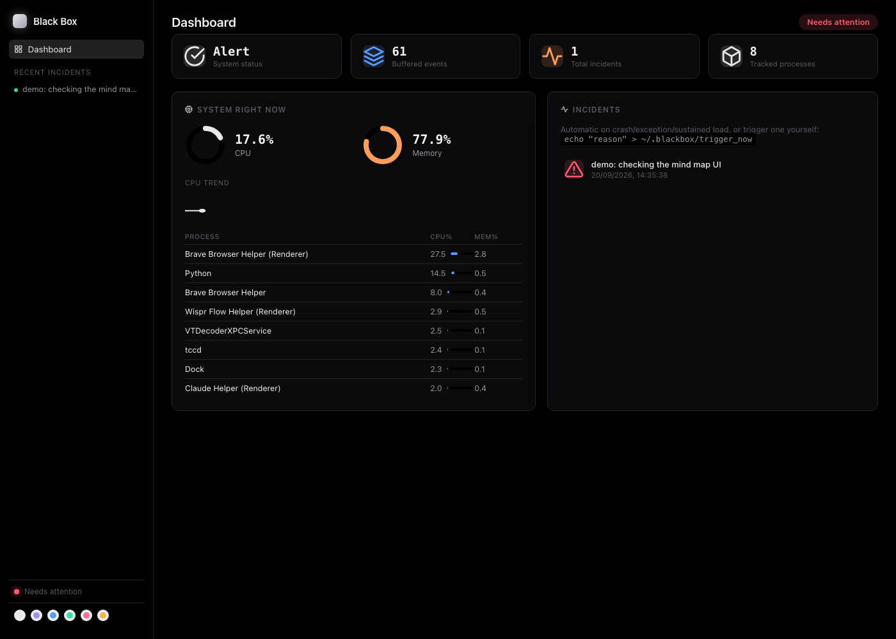
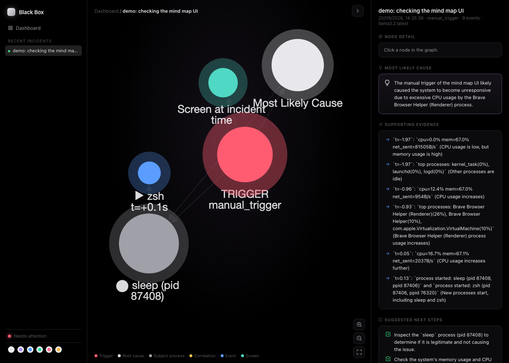

# Black Box

A local, privacy-first "aircraft black box" for your Mac.

It continuously watches your computer and keeps a rolling ~5-minute buffer of
activity (screen, system metrics, processes, optionally terminal commands, and
OS-level crash signals). When something goes wrong — a crash, an unhandled
exception, a resource blowup, or a manual trigger — it freezes that buffer,
correlates the evidence, and asks a **local** LLM running through
[Ollama](https://ollama.com) to explain what most likely happened and what to
do next. Nothing leaves the machine.

## Screenshots

True black throughout, with a switchable accent theme — monochrome
(white/gray) by default, or pick violet/blue/green/rose/amber from the
swatch picker in the sidebar. The choice is saved per-browser and recolors
the dashboard *and* the mind map's root-cause/subject nodes together.

**Dashboard** — live system health at a glance: CPU/memory as radial gauges
that shift from accent → orange → red by threshold, a CPU trend sparkline,
per-process mini bar charts, KPI tiles, and an OK / needs-attention banner.



**Incident mind map** — an Obsidian-style force-directed graph built to
answer three questions at a glance: what went wrong (the trigger, red), what
the AI thinks caused it (the root-cause hub, accent-colored), and what thing
was actually involved (the single most-implicated process, promoted into its
own glowing subject node with its name and pid — not a generic "event"
label). A chronological chain of the highest-signal events traces what led
up to it, and hovering any node highlights its neighborhood while fading the
rest. The side panel breaks the AI's explanation into structured cards —
Most Likely Cause, Supporting Evidence, Suggested Next Steps — instead of a
wall of markdown, and collapses out of the way when you want the graph
full-screen.



## Architecture

```
Computer
  -> Capture Layer        (app/capture: screen, system, processes, terminal, os_events)
  -> Normalized Event Stream (app/events: models, bus, normalizer)
  -> 5-Minute Circular Buffer (app/buffer)
  -> Failure / Manual Trigger (app/triggers: crash, exception, system, manual)
  -> Incident Manager      (app/incident: manager, snapshot, models)
  -> Evidence Processor     (app/evidence: processor, timeline, correlation)
  -> AI Debug Agent         (app/agent: debugger, tools, prompts)
  -> Ollama                 (app/llm: interface, ollama)
  -> Incident Report        (app/report + app/storage)
```

Every layer only knows about the layer below it — the capture collectors have
no idea an incident system exists, the buffer has no idea what a crash is, and
the AI agent never sees raw events, only a pre-correlated evidence package.

## Requirements

- macOS (this is not cross-platform, by design)
- Python 3.11+
- [Ollama](https://ollama.com) running locally with at least one model pulled
  (`ollama pull llama3.2` or similar)

## Setup

```bash
python3 -m venv venv
source venv/bin/activate
pip install -r requirements.txt
```

## Running

```bash
source venv/bin/activate
python -m app.main run
```

This starts capturing in the foreground. Stop with Ctrl-C — collectors shut
down cleanly.

### Dashboard

A local web dashboard starts automatically at
[http://127.0.0.1:8765](http://127.0.0.1:8765) (localhost only — see
`web.*` in `config.yaml` to change the port or disable it):

- **/** — live system health: KPI tiles (status, buffered events, incident
  count, tracked processes), CPU/memory as radial gauges plus a live CPU
  sparkline, a per-process table with inline usage bars, an OK /
  needs-attention banner, and the incident list.
- A theme swatch picker sits at the bottom of the sidebar on every page —
  monochrome by default, five accent colors to choose from, saved per-browser.
- **/incidents/&lt;id&gt;** — the mind map: the trigger (red) and the AI's
  extracted root cause (accent) as the hub, the single most-implicated
  process promoted into its own subject node (its actual name and pid, not a
  generic label), correlated evidence as spokes, a screenshot of the screen
  at the time, and the chronological chain of the highest-signal events.
  Hover a node to highlight its neighborhood; click it for the full evidence
  text. Zoom in/out/fit controls float over the graph. The collapsible side
  panel renders the AI's explanation as structured cards (Most Likely Cause,
  Supporting Evidence, Suggested Next Steps) rather than
  raw markdown.

### Triggering an incident manually

```bash
echo "app is frozen, capture now" > ~/.blackbox/trigger_now
```

The manual trigger poller picks this up, snapshots the buffer, and produces a
report the same way an automatic crash detector would.

### Where things end up

- `incidents/<incident_id>/raw_events.json` — the full raw event snapshot
- `incidents/<incident_id>/screenshots/` — screenshots referenced by that incident
- `incidents/<incident_id>/report.md` — the AI-generated report
- `incidents/blackbox.db` — SQLite index of every incident

## Configuration

Everything is tunable in `config.yaml` — retention window, capture intervals,
which collectors are enabled, resource thresholds, the Ollama model to use,
and more. See the comments in that file.

Notable privacy defaults:
- **Terminal capture is off by default.** Enabling it requires both flipping
  `capture.terminal.enabled` in config *and* manually sourcing
  `scripts/blackbox_zsh_hook.sh` from your shell rc — this project never edits
  your shell configuration for you. The hook only records the command text,
  exit code, cwd, and timing; it never captures stdout/stderr unless you
  explicitly turn that on too, and `redact_patterns` strip anything that looks
  like a password/token/secret before it's ever recorded.
- Screenshots are downscaled and deleted the moment they age out of the
  rolling buffer, unless they're copied into an incident snapshot.
- The AI agent talks only to a local Ollama endpoint (`localhost:11434` by
  default) — no cloud calls, ever.

## Switching models

Any locally pulled Ollama model works — just change `llm.model` in
`config.yaml`. This project has been exercised against `llama3.2:latest`,
`qwen3:14b`, and `llama3:8b`.

## Testing

```bash
source venv/bin/activate
python -m pytest
```

Every module is independently testable; the test suite mocks the Ollama HTTP
calls so it never depends on a running daemon.
